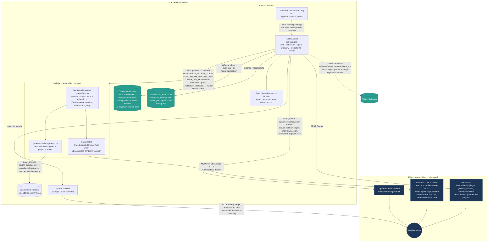
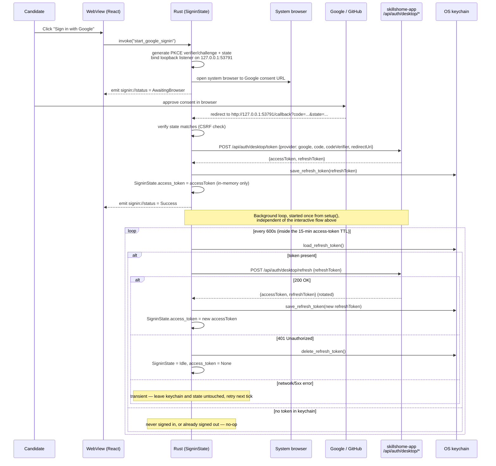
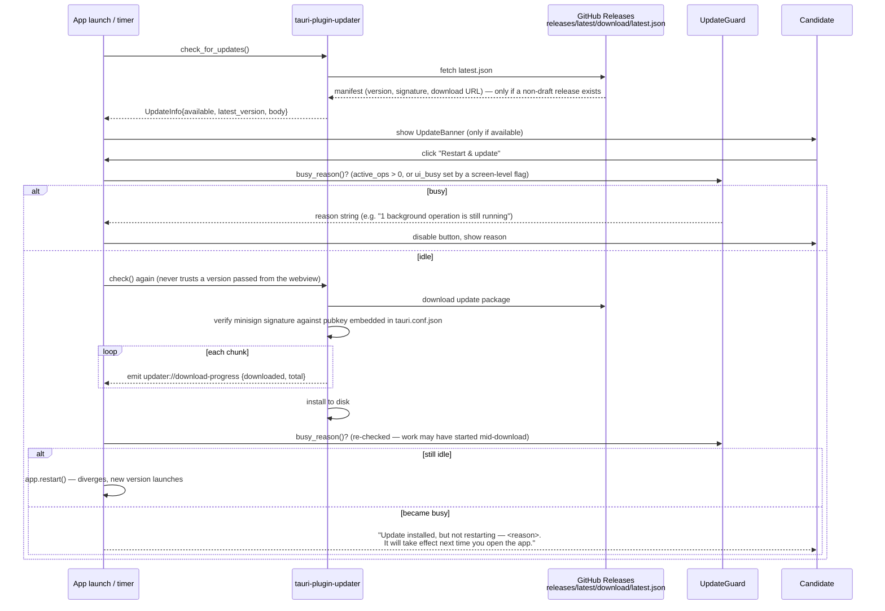

# SkillsHome Desktop — Architecture

> **Document version:** v1.0 (2026-08-11), re-checked 2026-08-31 — no change. `package.json` is
> still `0.1.4` and there have been zero commits to this repo since v1.0 was written, so the content
> below remains current; only this header was touched, to record that a check happened. See
> [Changelog](#changelog) at the bottom.
> Sits alongside `docs/verification/feature-28-desktop-auto-update.md` (signing-key setup + rollback
> procedure) and the (currently empty) `specs/desktop/` directory. Cross-referenced against
> [`skillshome-app`'s `docs/architecture.md`](../../skillshome-app/docs/architecture.md) — note
> that path assumes both repos are checked out as siblings under the same parent directory, e.g.
> `~/Documents/Product/{skillshome-app,skillshome-desktop}`; if your checkout differs, adjust the
> relative path. **Caveat, still open as of the re-check**: the canonical copy of that sibling doc
> on `skillshome-app`'s default branch remains shorter than the fuller version in that repo's
> `claude/architecture-diagram-docs-*` worktree (now itself further updated to v1.1) — if the link
> above looks thin or out of date, that rewrite still hasn't merged to `develop`.

## 1. One-line summary

SkillsHome Desktop is the Tauri (Rust + React) candidate-facing companion to
[`skillshome-app`](../../skillshome-app): it runs résumé/profile extraction **on the candidate's own
machine** — either against a local Ollama-style endpoint or the candidate's own frontier-model API
key — and syncs only the reviewed, confirmed result to their SkillsHome profile over MCP, so the raw
résumé never has to leave the device unless the candidate explicitly opts into the server-side
fallback pipeline. It is one of five repos in the SkillsHome ecosystem (`skillshome-app`,
`skillshome-desktop`, `skillshome-marketing`, `skillshome-skills-platform`,
`skillshome-sample-agents`) and the only one that runs on the candidate's machine rather than in the
cloud; it is a pure client of `skillshome-app` and re-implements none of its scoring, ontology, or
grading logic.

## 2. Architecture diagram



Key structural points, verified against the code (not assumed from the repo name):

- **Two runtimes, one app.** The Tauri Rust process hosts the OS window and the WebView (React);
  the frontend never talks to the network or the filesystem directly — every side effect goes
  through a `#[tauri::command]` (`src-tauri/src/lib.rs`), gated by
  `src-tauri/capabilities/default.json`. A command not listed there fails silently from the
  frontend with a capability error, not a compile error — noted explicitly in `CLAUDE.md`.
- **The sidecar is a real child process, not a Tauri "sidecar binary" in the strict Tauri-docs
  sense** (it's spawned via `tokio::process::Command`, not declared under
  `tauri.conf.json`'s `bundle.externalBin`). `src-tauri/src/ingest/sidecar.rs` picks one of two
  spawn strategies at runtime via `cfg!(debug_assertions)`:
  - **dev**: `npm run <script> --` against the checked-out `sidecar/` directory (fast iteration,
    assumes Node/npm present).
  - **release**: a bundled `node` (or `node.exe`) executable invoking pre-built `<script>.cjs`
    files, both shipped as Tauri bundle resources (`tauri.conf.json`'s `bundle.resources`,
    populated at CI build time by `sidecar/bundle.mjs` + `.github/workflows/release.yml`).
- **Only three things cross the Rust↔sidecar boundary**: env vars (`SKILLSHOME_ACCESS_TOKEN`,
  `SKILLSHOME_BACKEND_URL`, and — Local_Model/BYOK_Frontier only — `BYOK_API_KEY`), an optional
  stdin payload (the edited `ReviewPackage` JSON for confirm), and a single
  `__SIDECAR_RESULT__:{...json...}` line the sidecar prints as the *last* line of stdout. The
  sidecar's own dependency (`@menporulalar/agents-core`) writes its own JSON log lines to stdout
  too, so `sidecar.rs` scans for the *last* marker line and treats everything else as
  informational — mirrored by every sidecar entry point routing its own progress messages to
  stderr instead.
- **OS keychain, confirmed narrowly.** Only the refresh token and the BYOK API key live in the
  keychain (`src-tauri/src/auth/token_store.rs`, via `keyring`/`keyring-core` with a per-OS backend
  crate: `apple-native-keyring-store`, `windows-native-keyring-store`,
  `zbus-secret-service-keyring-store`). The **access token is not in the keychain** — it lives only
  in an in-memory `Mutex` (`SigninState`, `src-tauri/src/auth/state.rs`) and is re-derived from the
  keychain'd refresh token on every app launch. This matches the claim in `skillshome-desktop`'s own
  `README.md` ("the key is stored only in your OS's native credential store... never sent to
  SkillsHome's servers") for the BYOK key specifically, and is the same in-memory-access-token /
  persisted-refresh-token split `skillshome-app`'s own auth model uses for the web app (per its
  `CLAUDE.md`).
- **MCP transport is Streamable HTTP, not stdio or SSE-as-a-separate-endpoint.** `sidecar/src/
  mcpClient.ts` uses `@modelcontextprotocol/sdk`'s `StreamableHTTPClientTransport` pointed at
  `{backendUrl}/api/mcp`, with the access token passed as a plain `Authorization: Bearer` header on
  the transport's `requestInit` — the same JWT the REST client uses, not a separate OAuth
  client-credentials grant. (`skillshome-app`'s architecture doc corroborates: "Auth is the same JWT
  scheme as the REST API — no OAuth 2.1/client-credentials yet.")

## 3. Core workflows

### 3.1 Sign-in and token lifecycle

Two independent sign-in flows exist because the desktop app can't reuse `skillshome-app`'s existing
web OAuth client registrations: Google requires a separate "Desktop app"-type OAuth client (the only
type Google allows an any-port loopback redirect for), and GitHub's existing OAuth App only supports
one callback URL, already used by web login — so GitHub uses Device Flow (RFC 8628) instead, which
needs no callback at all. Both converge on the same backend exchange endpoint.



GitHub's flow differs only in steps 2–6: `start_github_device_signin` POSTs to
`github.com/login/device/code`, opens the browser to `verification_uri`, emits
`AwaitingDeviceConfirmation { user_code, verification_uri }` so the UI can show the code, then polls
`github.com/login/oauth/access_token` on the server-given interval (backing off on `slow_down`)
before exchanging the resulting GitHub access token via the same `/api/auth/desktop/token` route
(`provider: github`). Sign-out (`sign_out` command) clears the in-memory token, resets status to
`Idle`, and deletes the keychain'd refresh token — the mirror image of sign-in.

### 3.2 Local extraction → MCP stage → review → confirm (Local_Model / BYOK_Frontier)

This is the privacy-preserving path the README leads with. The résumé's raw text never leaves the
machine — only the structured extraction result (skills/experience/projects) is sent to the server,
and only after the candidate reviews it.

```mermaid
sequenceDiagram
    participant U as Candidate
    participant W as WebView
    participant R as Rust (ingest::sidecar)
    participant SC as Node sidecar
    participant LLM as Local_Model endpoint<br/>(Ollama) / BYOK provider
    participant MCP as skillshome-app<br/>/api/mcp

    U->>W: pick résumé file, choose profile
    W->>R: invoke("start_local_extraction_and_stage", {profileId, filePath})
    R->>R: begin_op() — UpdateGuard now blocks an update restart
    R->>SC: spawn "stage" script<br/>env: SKILLSHOME_ACCESS_TOKEN, SKILLSHOME_BACKEND_URL, BYOK_API_KEY?
    SC->>SC: resolveActiveExtractionSource() + resolveExtractionConfig()<br/>reads extraction_settings.json directly off disk
    SC->>LLM: run local extraction (agents-core), résumé text stays local
    LLM-->>SC: extracted skills / experience / projects
    SC->>MCP: connect (StreamableHTTPClientTransport, Bearer access token)
    SC->>MCP: tool call profile.ingest.stage {profileId, inputType, extractionSource, ...extractionResult}
    MCP-->>SC: {jobId, reviewPackage} — job created at status "awaiting_review", nothing live yet
    SC-->>R: stdout line "__SIDECAR_RESULT__:{ok:true, jobId, reviewPackage}"
    R->>R: drop OpGuard (op complete)
    R-->>W: {jobId, reviewPackage}
    W->>U: show ReviewConfirmScreen — accept/edit/reject each item

    U->>W: confirm reviewed package
    W->>R: invoke("confirm_local_extraction", {profileId, confirmedItems})
    R->>R: begin_op() — a write to the profile; must not be interrupted by a restart
    R->>SC: spawn "confirm" script, writes confirmedItems JSON to child stdin
    SC->>MCP: tool call profile.ingest.confirm {profileId, confirmedItems}
    MCP-->>SC: {success: true} — now committed to the live profile
    SC-->>R: stdout "__SIDECAR_RESULT__:{ok:true, success:true}"
    R->>R: drop OpGuard
    R-->>W: success
    W->>U: back to Home
```

If local extraction or the MCP stage call fails, `useLocalExtraction.ts` retries with the same
backoff formula as `packages/agents-core`'s `BaseAgent.run()` (`1000 * 2^(attempt-1)`, capped at
15s) before offering a manual "Retry via Server_Fallback" — a one-flow-only override
(`forceServerFallback` state in `App.tsx`) that never touches the persisted `active_source` setting.

The **project-sync** flow (`sidecar/src/run-project-sync.ts`, spawned from
`src-tauri/src/projectsync/mod.rs`) is a variant of the same stage-only half: it scans one
`Local_Project_Grant`'d folder, hashes the findings, and stages via the identical
`profile.ingest.stage` tool — but only when the hash differs from the server-recorded
`lastSignalHash` (dedup), and it never calls confirm itself; the candidate reviews it like any other
staged package.

### 3.3 Server_Fallback ingestion (REST, no sidecar)

The one path where a file actually leaves the machine — it hands the raw file to the exact same
upload-based pipeline the web app uses, with `autoConfirm: true` (per `skillshome-app`'s
per-path ingestion review gate — see its `CLAUDE.md`), so there is deliberately **no** review step on
this path; the desktop UI reflects that by skipping straight past `ReviewConfirmScreen`.

```mermaid
sequenceDiagram
    participant U as Candidate
    participant W as WebView
    participant R as Rust (auth::backend_client)
    participant S as skillshome-app REST API

    U->>W: pick file, choose profile, choose Server_Fallback
    W->>R: invoke("start_server_fallback_ingest", {profileId, filePath})
    Note over R: deliberately NOT UpdateGuard-wrapped — returns in ms;<br/>the long wait is client-side polling below, which<br/>an OpGuard held for one command's duration can't span
    R->>S: POST /api/profiles/{id}/ingest (multipart, Bearer token)
    S-->>R: 202 Accepted, jobId
    loop poll until terminal status
        W->>R: invoke("get_server_fallback_ingest_status", {profileId})
        R->>S: GET /api/profiles/{id}/ingest/status
        S-->>R: {status, progress, ...}
    end
    S-->>R: status: complete (already committed — autoConfirm: true, no reviewPackage attached)
    R-->>W: done
    W->>U: back to Home (no review screen — nothing left to confirm)
```

### 3.4 Auto-update



`UpdateGuard` (`src-tauri/src/update.rs`) is a counted RAII guard (`active_ops: AtomicUsize`), not a
boolean — two overlapping operations (e.g. an extraction and a project scan) can't clear each
other's protection when one finishes early. Every long-running command that mutates state
(`start_local_extraction_and_stage`, `confirm_local_extraction`, `confirm_server_fallback_ingest`,
`start_mock_interview`, `submit_interview_turn`, `run_project_sync`) holds an `OpGuard` for its full
`async` duration. A separate `ui_busy` flag, settable only from the frontend
(`set_update_ui_busy`), covers screen-level state Rust can't see on its own — an open, unconfirmed
review screen or an open interview session — and supplements rather than replaces the `active_ops`
counter.

## 4. UI surface (`src/`)

| Area | Screens | Purpose |
|---|---|---|
| Sign-in | `auth/SigninScreen.tsx` | Signed-out landing view — Google / GitHub buttons, renders the device-flow user code when GitHub is chosen |
| Home | `auth/HomeScreen.tsx` | Signed-in landing — entry points to extraction, settings, projects, mock interview, sign-out |
| Extraction settings | `extraction/ExtractionSettingsScreen.tsx`, `LocalModelDisclaimerBanner.tsx` | Configure `Extraction_Source` (Server_Fallback / Local_Model / BYOK_Frontier); persistent quality disclaimer while Local_Model is active |
| Ingestion flow | `ingest/SourcePickerScreen.tsx` → `ingest/ExtractionProgressScreen.tsx` → `ingest/ReviewConfirmScreen.tsx` | Pick a file or URL (URL input is Server_Fallback-only — no local GitHub-scanning agent exists yet) → run/poll extraction → review and confirm the staged `ReviewPackage` |
| Connected projects | `project-sync/ConnectedProjectsScreen.tsx` | List/add/remove locally-connected project folders, with per-project consent; shows staleness against the on-open/weekly scan cadence |
| Mock interview | `interview/MockInterviewScreen.tsx`, `interview/CodeAnswerEditor.tsx` | Role-template picker → turn-by-turn interview UI; a lazily-loaded CodeMirror editor appears only for `coding_challenge` questions |
| Update | `update/UpdateBanner.tsx` | Non-intrusive "update available" banner, shown only on the Home screen, never over an in-progress flow |

`App.tsx` owns all cross-screen state (`useSignin`, `useExtractionSettings`,
`useServerFallbackIngest`, `useLocalExtraction` are all instantiated once at the top and threaded
down) and a simple `Screen` union (`"home" | "settings" | "picker" | "progress" | "review" |
"projects" | "interview"`) rather than a router — there is no client-side routing library in this
app.

## 5. Module / service layer

### Rust (`src-tauri/src/`)

| Module | One-liner |
|---|---|
| `main.rs` / `lib.rs` | Entry point; registers every `#[tauri::command]`, manages app-wide state (`SigninState`, `ExtractionSettingsState`, `UpdateGuard`, `GrantsState`), starts the silent-refresh background loop |
| `auth/state.rs` | In-memory `SigninState` (access token + status) — never persisted |
| `auth/token_store.rs` | OS-keychain-backed storage for the refresh token and the BYOK API key (`keyring`/`keyring-core`) |
| `auth/google.rs` | Google sign-in via RFC 8252 loopback redirect + PKCE (fixed port 53791) |
| `auth/github_device.rs` | GitHub sign-in via RFC 8628 Device Flow (no callback URL) |
| `auth/backend_client.rs` | Thin REST client for `skillshome-app`'s `/api/auth/desktop/{token,refresh}` and profile/ingest-status endpoints |
| `auth/silent_refresh.rs` | Background loop (every 600s) restoring/keeping a session alive from the keychain'd refresh token |
| `auth/pkce.rs` | PKCE verifier/challenge + CSRF state generation, mirroring `skillshome-app`'s `lib/authUtils.ts` |
| `extraction/settings.rs` | Persisted, non-sensitive `ExtractionSettings` (plain JSON file, not `tauri-plugin-store`) |
| `extraction/check.rs` | One-time connectivity/format self-check for Local_Model/BYOK_Frontier before activation — a strict structured-JSON round-trip against the real provider shapes |
| `ingest/mod.rs` | Server_Fallback file-side glue (MIME detection, byte reading) |
| `ingest/sidecar.rs` | Spawns the Node sidecar (dev: `npm run`; release: bundled `node` + `.cjs`), parses the `__SIDECAR_RESULT__:` marker line |
| `interview/mod.rs` | Mock-interview session creation over REST + turn submission over the MCP sidecar; also splices in a locally-regenerated opening question when Interview_Source is Local_Model/BYOK_Frontier |
| `projectsync/mod.rs` | Connected-projects REST CRUD + the `run_project_sync` sidecar spawn |
| `projectsync/grants.rs` | `Local_Project_Grant` persistence — the only place a real local folder path is ever stored |
| `update.rs` | `UpdateGuard` (restart-blocking RAII counter), `check_for_updates`/`apply_update` via `tauri-plugin-updater` |

### TypeScript frontend (`src/`)

| Module | One-liner |
|---|---|
| `errors/mapDesktopError.ts` | Normalizes raw MCP/backend error strings into user-facing messages; never shows a raw stack trace or MCP error string |
| `auth/useSignin.ts` | Wraps the sign-in commands + `signin://status` event listener |
| `extraction/useExtractionSettings.ts` | Wraps the extraction-settings commands, mirrors the Rust `ExtractionSettings` type |
| `ingest/useServerFallbackIngest.ts` | REST polling hook for the Server_Fallback path |
| `ingest/useLocalExtraction.ts` | Sidecar-invoking hook for Local_Model/BYOK_Frontier, with the agents-core-matching retry/backoff |
| `project-sync/useProjectSync.ts` | Connected-projects state + the on-open/weekly scan scheduler (`ProjectSyncScheduler`, mounted whenever signed in) |
| `interview/useMockInterview.ts` | Session/turn state for the mock interview flow |
| `update/useUpdateCheck.ts` | Wraps `check_for_updates`/`apply_update` + download-progress event listener |

### Node.js sidecar (`sidecar/src/`)

All entry points share the `__SIDECAR_RESULT__:` stdout-marker / stderr-progress convention and are
bundled by `sidecar/bundle.mjs` into single-file CommonJS output for release builds (dev builds run
the `.ts` sources directly via `ts-node`).

| Module | One-liner |
|---|---|
| `mcpClient.ts` | Wraps `@modelcontextprotocol/sdk`'s `Client` over `StreamableHTTPClientTransport`; exposes `stageIngestion`, `confirmIngestion`, `proposeInterviewTurn`, `readInterviewSession`, `getProfileContext`; parses structured MCP tool error reasons |
| `resolveExtractionConfig.ts` | Reads `extraction_settings.json` off disk (no Tauri IPC) and builds an `LLMCallConfig` for `@menporulalar/agents-core` |
| `resolveInterviewLoopConfig.ts` | Same resolution, for interview question (re)generation |
| `run-local-extraction.ts` | Runs local extraction agents against a picked file — no MCP call, used standalone for manual CLI testing |
| `run-local-extraction-and-stage.ts` | (entry point `stage`) — extraction + `profile.ingest.stage`; stage-only, never confirms |
| `confirm-staged-ingestion.ts` | (entry point `confirm`) — reads the edited `ReviewPackage` from stdin, calls `profile.ingest.confirm` |
| `run-project-sync.ts` | (entry point `project-sync`) — scans one granted folder, dedups against the server's `lastSignalHash`, stages findings |
| `run-interview-opening-question.ts` | (entry point `interview-opening`) — regenerates just the opening question's text locally |
| `run-interview-turn.ts` | (entry point `interview-turn`) — submits an interview turn over MCP; grading is always server-side |
| `src/__tests__/*.test.ts` | Run directly with `ts-node` (`npm test` in `sidecar/`) — no Jest/Vitest configured |

`stage`, `confirm`, `project-sync`, `interview-opening`, and `interview-turn` are the **stable script
names** the Rust side spawns by exact string — renaming any of them requires updating
`src-tauri/src/{ingest/sidecar.rs, interview/mod.rs, projectsync/mod.rs}` in the same change.

## 6. Local data

This app has no embedded database (no SQLite, no `tauri-plugin-store`) — all local persistence is
hand-wired plain JSON under the Tauri app-data directory, plus the OS keychain for secrets:

| Location | Contents | Sensitivity |
|---|---|---|
| `<app-data-dir>/extraction_settings.json` | `ExtractionSource` choice (Server_Fallback/Local_Model/BYOK_Frontier) for both extraction and interview, `LocalModelConfig` (endpoint/model — no secret), `ByokFrontierConfig` (provider/model — no key) | Non-sensitive by design; the BYOK key itself is deliberately excluded from this file |
| `<app-data-dir>/project_grants.json` | `LocalProjectGrant[]` — real local folder paths, candidate-chosen labels, last-scan timestamps | Sensitive locally (real filesystem paths) but never transmitted — the server only ever sees the label |
| OS keychain (`com.skillshome.desktop` service) | `refresh_token`, `byok_api_key` | Secrets — never touch disk as plaintext |
| *(not persisted anywhere)* | Access token | In-memory only, `SigninState`'s `Mutex`; lost on quit, re-derived from the refresh token on next launch |

No résumé content, extracted skill data, or profile data is cached locally at any point — extraction
output either streams straight into an MCP `stage` call or, for Server_Fallback, is uploaded and the
desktop app never stores a local copy.

## 7. Build & release

- **Frontend build**: `tsc && vite build` → `dist/` (Vite dev server on port 1420 in dev, per
  `tauri.conf.json`'s `build.devUrl`).
- **Tauri bundler** (`src-tauri/tauri.conf.json`): `bundle.active: true`, `targets: "all"`,
  `createUpdaterArtifacts: true` (produces the signed update package + `latest.json` alongside the
  installer). `bundle.resources` stages the sidecar's bundled `node`/`node.exe` binary and its
  compiled `dist/*.cjs` files into the app bundle — `tauri.windows.conf.json` overrides the resource
  mapping to `sidecar/node.exe` for Windows.
- **Release workflow** (`.github/workflows/release.yml`): triggered by pushing a `v*` tag (or
  `workflow_dispatch` for a no-publish smoke build — an empty `tagName` makes `tauri-action` build
  everything without creating a release). Matrix: macOS `aarch64-apple-darwin` +
  `x86_64-apple-darwin`, `ubuntu-22.04`, `windows-latest`. Per-platform steps:
  1. Check out the `brand` submodule over rewritten HTTPS (no SSH key on the runner; `brand` is
     public, `specs` is not and is deliberately *not* checked out here).
  2. Stage the bundled sidecar: `npm ci && npm run bundle` inside `sidecar/`, copy the resulting
     `.cjs` files, then copy a **matching-architecture** `node` binary as a Tauri resource — macOS
     downloads the correct per-arch Node tarball explicitly (the runner is always arm64, but the
     x86_64 leg targets Intel Macs), while Linux and Windows reuse the runner's own `node`/`node.exe`
     since neither has a cross-arch matrix split.
  3. Build via `tauri-apps/tauri-action`, with `SKILLSHOME_BACKEND_URL`, `GOOGLE_DESKTOP_CLIENT_ID`,
     `GITHUB_DEVICE_CLIENT_ID` injected as plain (non-secret — these are public identifiers) env
     vars, and `TAURI_SIGNING_PRIVATE_KEY` as the one real secret, for **updater** signing.
  4. Publish as a **draft** release (`releaseDraft: true`) — a human inspects the attached
     `latest.json` and promotes it manually; nothing reaches existing installs until then, since the
     updater endpoint (`releases/latest/download/latest.json`) only resolves non-draft releases.
- **Version must match across three files** before tagging: `package.json`, `src-tauri/Cargo.toml`,
  and `src-tauri/tauri.conf.json` — the last of these is what `update.rs` reads as the version the
  updater compares against, not `CARGO_PKG_VERSION`.
- **Two unrelated "signing" concepts** — worth stating precisely since the code comments themselves
  call this out as a common confusion: **OS code signing** (Apple notarization, a Windows
  code-signing certificate) is *not yet set up* — builds are currently unsigned, and macOS
  Gatekeeper / Windows SmartScreen will warn on first launch (documented workarounds live in the
  README). **Updater signing** (a minisign keypair — `src-tauri/.tauri-keys` /
  `.tauri-keys.pub`, both gitignored) *is* configured and enforced: `tauri-plugin-updater` verifies
  every downloaded update package against the public key embedded in `tauri.conf.json`'s
  `plugins.updater.pubkey` before installing it, with no code path able to skip or weaken that
  check.

**A gap worth flagging**: `src-tauri/src/ingest/sidecar.rs`'s own doc comment says the release-mode
bundled-sidecar spawn path is "macOS only for now; Windows/Linux are a follow-up" — but
`release.yml` as it stands today stages the bundled `node` binary and `.cjs` dist files for **all
three** platforms (macOS both archs, Linux, Windows), including a Windows-specific resource mapping
in `tauri.windows.conf.json`. Either the comment is stale (Windows/Linux support landed after it was
written) or the resources are staged but the release-mode spawn path hasn't actually been verified
end-to-end on those platforms yet. Worth confirming which, rather than trusting either the comment
or the workflow file alone.

## 8. Security model

- **Access token**: in-memory only (`SigninState`'s `Mutex`), never written to disk, cleared on
  sign-out and on quit. Re-derived from the keychain'd refresh token via the silent-refresh loop on
  every launch.
- **Refresh token**: OS keychain only (`keyring`/`keyring-core`), rotated on every successful
  refresh call — a stale/rejected refresh token clears the keychain entry immediately rather than
  leaving it around for a future retry to fail on again.
- **BYOK API key**: OS keychain only, a separate entry from the refresh token. Transmitted nowhere
  except as a plain child-process environment variable to the local Node sidecar, which uses it to
  call the chosen frontier provider directly — it never reaches `skillshome-app`'s servers.
- **MCP authentication**: the sidecar's MCP client sends the same access token as a bearer JWT on
  the `Authorization` header of the Streamable HTTP transport — no separate MCP-specific credential.
  Per `skillshome-app`'s own architecture doc, the server re-checks ownership on every tool call
  rather than trusting the transport, and each tool is rate-limited server-side.
- **Local-endpoint defense in depth**: a Local_Model endpoint defaults to loopback-only
  (`127.0.0.1`/`localhost`/`::1`); a non-loopback endpoint is rejected unless the candidate
  explicitly opts in. This is enforced **twice** — a client-side mirror in
  `ExtractionSettingsScreen.tsx` for immediate UX feedback, and, authoritatively, in Rust's
  `validate_local_model_endpoint` (`lib.rs`), which never trusts the frontend's own check alone.
- **Update-restart safety**: `UpdateGuard`'s counted `active_ops` + frontend-declared `ui_busy` flag
  block a restart-to-apply while an extraction, project scan, interview turn, or unconfirmed review
  screen is in flight — checked once before downloading and again immediately before the actual
  restart, since a download can take long enough for new work to have started in the meantime.
- **Local-only vs. networked boundary**: for Local_Model/BYOK_Frontier, résumé text is read and
  processed entirely inside the Node sidecar and sent directly to the local/BYOK LLM endpoint — it
  never transits `skillshome-app`'s infrastructure. Only the *extracted, structured* result
  (skills/experience/projects) crosses the network, via MCP `profile.ingest.stage`, and only after
  the candidate reviews and confirms it. Server_Fallback is the sole path where the raw file itself
  is uploaded, using the exact same server-side pipeline the web app's own upload flow uses
  (`autoConfirm: true`, per `skillshome-app`'s per-path ingestion review-gate design — there is no
  review step on this path by design, not by omission).
- **Project-sync path privacy**: the real local folder path for a connected project lives only in
  `project_grants.json` on the candidate's machine. `connect_local_project` sends the server a
  candidate-chosen display label plus explicit consent — never the path — and every later sync
  round-trip (`run_project_sync`) sends only derived scan findings, never the folder's real location
  or raw file contents.
- **Updater package integrity**: verified via a minisign keypair independent of OS code signing (see
  §7) — a tampered or unsigned update manifest fails inside `tauri-plugin-updater`'s own `check()`/
  `download_and_install()` and surfaces as an `Err`, with no bypass path in `update.rs`.

## 9. Where to look next

- [`../../skillshome-app/docs/architecture.md`](../../skillshome-app/docs/architecture.md) —
  ecosystem-wide overview; §4.4 has the MCP/desktop sequence diagram from the server's side, §7 has
  the precise MCP server tool/resource/rate-limit table this doc's §2–3 draw on. (See the caveat at
  the top of this doc about which branch/worktree has the current version.)
- `../../skillshome-app/docs/architecture/desktop-mcp-development-conventions.md` — the shared
  conventions doc governing this repo, `packages/agents-core`, and the MCP surface together; read
  this before making any change that touches the Rust↔sidecar↔MCP boundary.
- This repo's `docs/verification/feature-28-desktop-auto-update.md` — signing-key setup detail and
  the update rollback/pin procedure (what to do if a bad release ships).
- This repo's `specs/` (a shared git submodule with `skillshome-app` and `skillshome-marketing`) —
  `specs/desktop/` is empty today ("new desktop specs land here going forward"); the desktop-relevant
  specs that already exist live under `specs/app/kiro/` — `mcp-foundation-profile-extraction-agent`
  (Module 4 — extraction/staging/sidecar), `living-profile-project-skill-sync` (#25 — project sync),
  `feature-28-desktop-auto-update` (#28 — the updater), and `ai-interview-agent` (mock interview) —
  each with `requirements.md`/`design.md`/`tasks.md`/`security-review.md`.
- `CLAUDE.md` in this repo — the terse day-to-day reference (stack map, security invariants,
  IPC/capability gotcha, sidecar contract, release-process checklist) this document expands on.

## Changelog

| Version | Date | What changed |
|---|---|---|
| v1.0 | 2026-08-11 | Initial version. |
| — | 2026-08-31 | Re-checked against current code: zero commits to this repo since v1.0, `package.json` still `0.1.4`. No content change; header updated to record the check. |
